ReadMe.txt

#WeChatMiniApp

This is a Simple Demonstration Using MiniApp and some basic APIs.  
We also build a simple php-mysql backend using xampp. 

##Demo
We will demonstrate connecting miniApp to backend using a simple Business requets platform

##Submitting the form
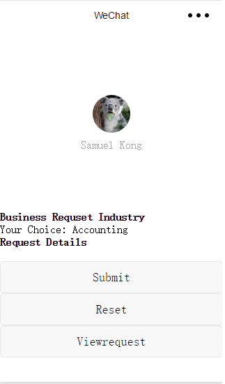
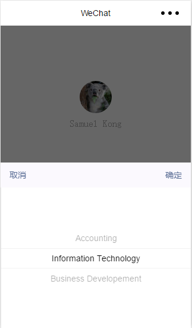
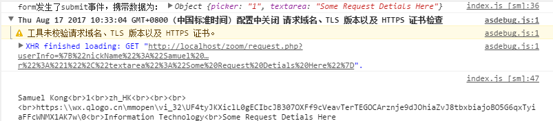

##Getting data from db and displaying it
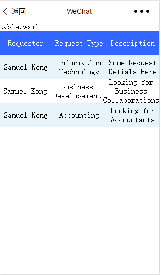
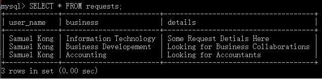
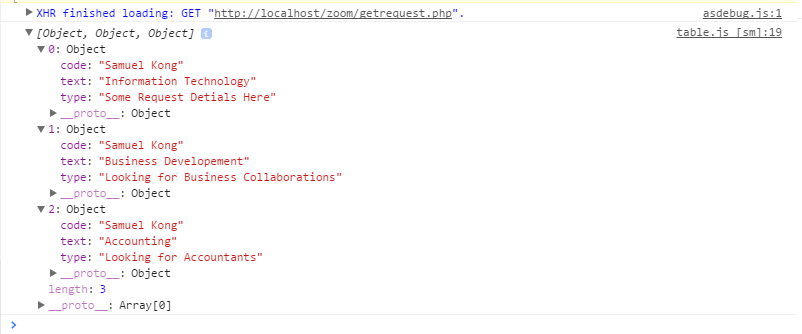

##Part 2 Getting user detials and decrypting them

Getting userInfo with option withCredentials: true （See app.js) 
Documentation： https://mp.weixin.qq.com/debug/wxadoc/dev/api/network-request.html  

(We only displayed the encryptedData and iv part here)
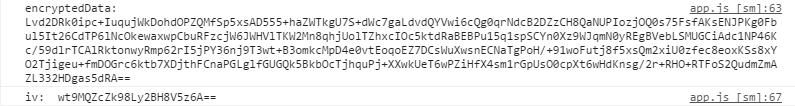

After getting code from wx.login，we will then submit the code to our login.php and it will get session_key and 
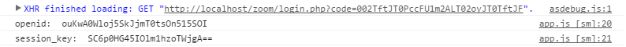

Decrypting data by calling PHP/demo.php 
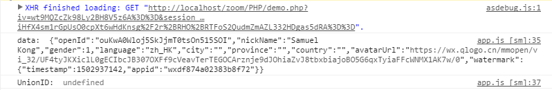

Setting Up the Backend
1.Installing xampp and starting the Apache and MySQL service
https://www.apachefriends.org/download.html

2. Copy the file zoom ito htdocs under the xampp root file

3. Import the mysql db

Setting up the MiniApp
1. Login https://mp.weixin.qq.com/ Wechat platform and and select the Add Mini App tab (you have to first passed the WeChat verification for company first http://kf.qq.com/faq/120911VrYVrA151214Fz26zm.html)

2. Create admin acount for MiniApp and fillin verification details

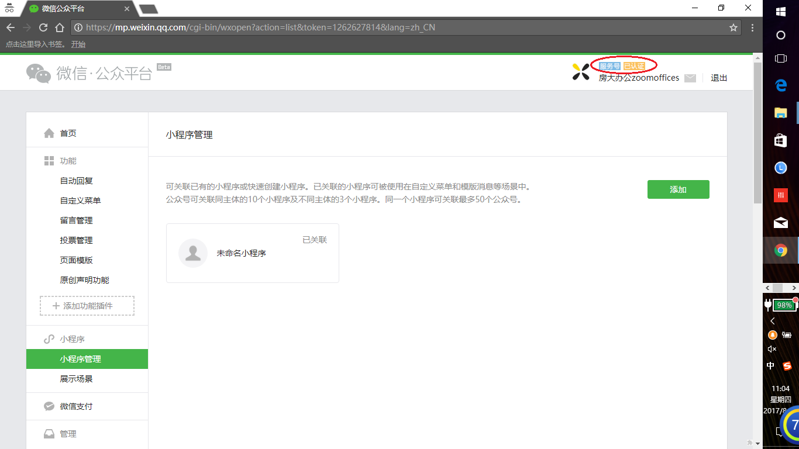

3. Login https://mp.weixin.qq.com/ again with the Mini App admin account, from there u should see the MiniApp tab

4. Add developers
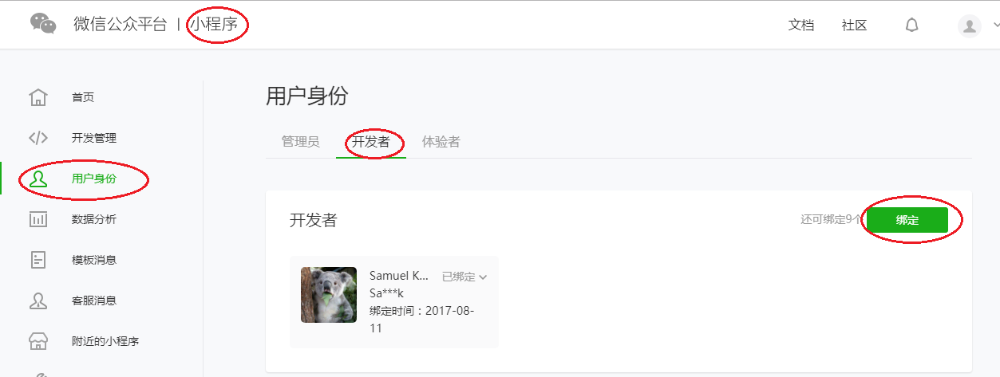

5. Acquire the AppID and AppSecret fromt the option tab
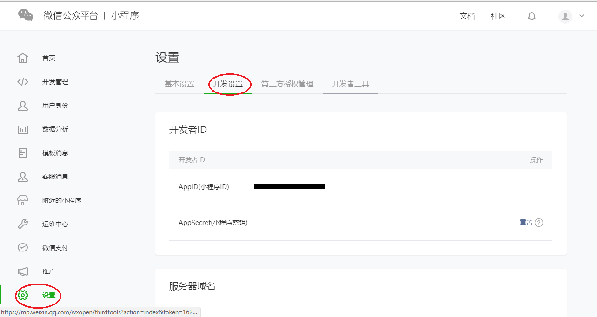

6.Download the WeChat Developer Tool and login by scanning using the developers' wechat account

7.Filling the AppId and AppSecret and import the code

